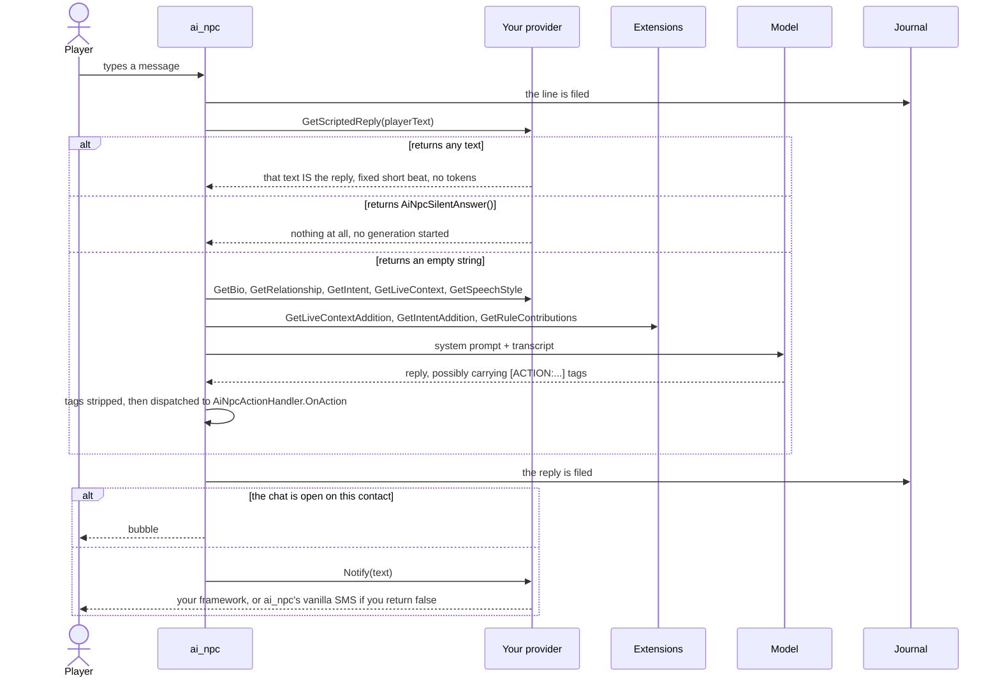
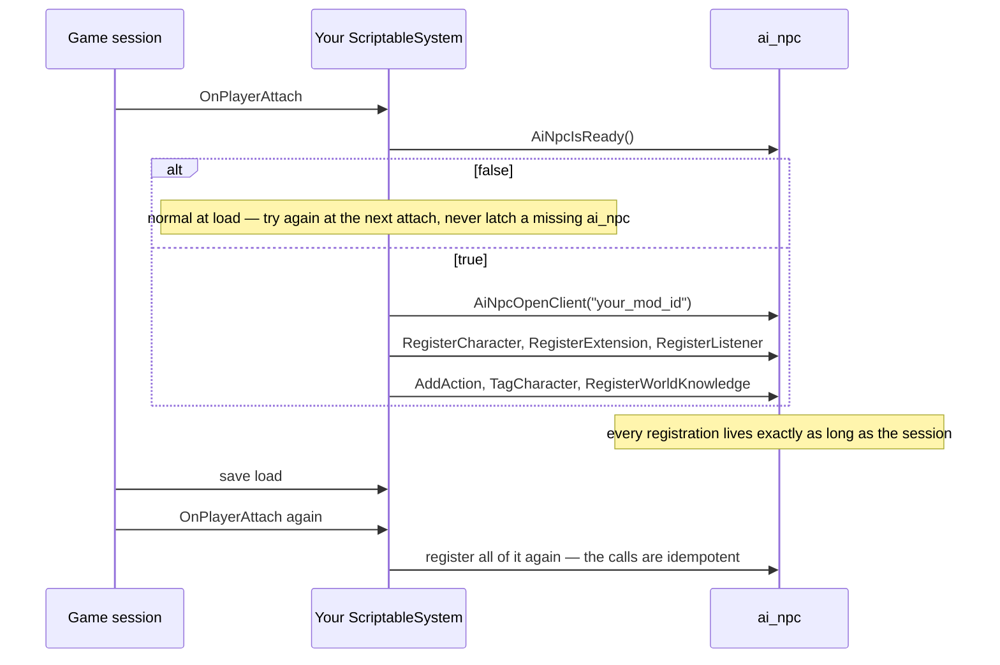
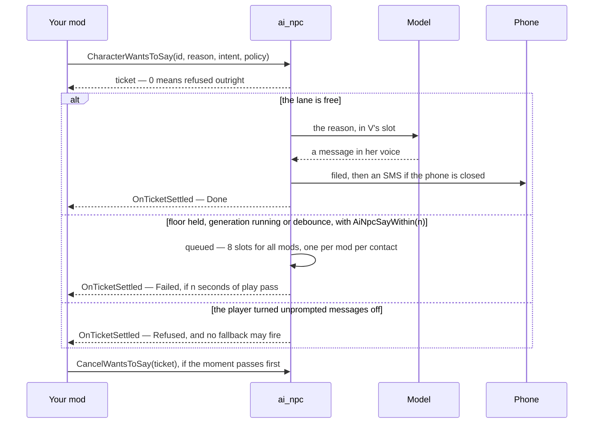
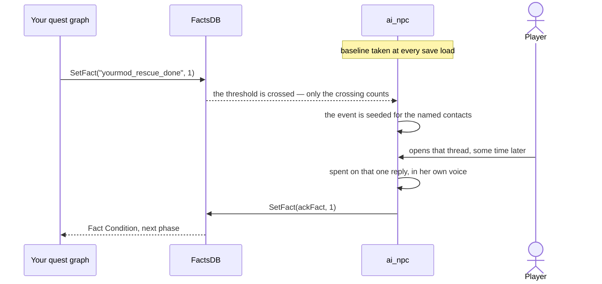

# ai_npc API

ai_npc drives a texting conversation for a fixed cast of vanilla characters. This is the
reference for another mod joining in.

Everything callable lives in `r6\scripts\ai_npc\api\`, in `module AiNpc`. Nothing outside that
folder is part of the contract. The reasoning behind the shapes below — why a vocabulary is a
function, why an extension has no `GetBio`, what each rule was measured against — is in
[API_DESIGN.md](API_DESIGN.md).

**Contents** — [Choosing a lane](#choosing-a-lane) · [Hello world](#hello-world) ·
[How it fits together](#how-it-fits-together) · [Script reference](#script-reference) ·
[Channels](#channels) ·
[JSON reference](#json-reference) · [How-tos](#how-tos) ·
[Where each piece lands](#where-each-piece-lands) · [Traps](#traps)

---

## Choosing a lane

| | You DECLARE a contact | You EXTEND a contact |
|---|---|---|
| Who this person is — bio, relationship, speech | yours to say | not yours to say |
| Commands the model may emit | yes | yes |
| A line of live context per message | yes | yes |
| How many mods at once, per contact | **one** | any number |
| On a clash | refused, first claim wins | there is no clash |

A vanilla character is already declared — **extend** her. Redefining one is the player's call,
through `characters.builtin.json`.

Declaring comes two ways:

| | JSON file | Script provider |
|---|---|---|
| Compile-time dependency on ai_npc | **none** | yes, behind `@if` |
| Works without ai_npc installed | the file is never read | yes, degraded half |
| Text computed from game state | fixed variants only | yes |
| Register / unregister mid-session | no | yes |

Start with JSON. Move to a provider when you hit its ceiling.

If you only want a character ai_npc already drives to react to **your quest**, you need
neither: see [React to my quest](#react-to-my-quest).

> **Before anything else, set up the answering lane.** Nothing here is observable without a
> model replying. OpenRouter with a few dollars on it is the recommended lane and the only one
> that lets you compare models — `docs/MODEL_COSTS.md` has the numbers, `docs/DISTRIBUTION.md`
> the terms of the CLI lanes.

---

## Hello world

### As data — a contact with a voice, no code

`<game>\r6\storages\AiNpc\characters.mymod.json`:

```json
{
    "version": 1,
    "characters": [
        {
            "contactId": "MyModContact01",
            "displayName": "Nadia",
            "bio": "You're Nadia, a fixer working out of Kabuki.",
            "relationship": "You met V once, on a job that went sideways.",
            "intent": "You want V to take the Kabuki job."
        }
    ]
}
```

`contactId` **must equal** the `contactId` your mod puts on the `ContactData` it injects into
the phone. ai_npc gives a voice to a contact that is already reachable; it does not put
contacts in the phone.

### As script — the same contact, computed

```reds
import AiNpc.*

public class NadiaProvider extends AiNpcContactProvider {
    public func GetContactId() -> String { return "MyModContact01"; }
    public func GetDisplayName() -> String { return "Nadia"; }
    public func GetBio() -> String { return "You're Nadia, a fixer working out of Kabuki."; }
    public func GetLiveContext() -> String {
        return s"Current job offer on the table: \(MyMod.GetOpenOfferLabel()).";
    }
}

// In a ScriptableSystem's OnPlayerAttach:
AiNpcOpenClient("your_mod_id").RegisterCharacter(new NadiaProvider());
```

Override only what you need — every method has a default, and an empty string means
"no opinion" exactly as an absent JSON key does.

---

## How it fits together

### The life of one message



### Registering, and what a save load takes away



Conversations are **not** in that list: they belong to the journal, so re-registering an id
resumes where it left off.

### A character writing first



### The quest-fact bridge



---

## Script reference

```reds
import AiNpc.*
```

Two shapes, and one rule picks between them: **a free function reads, a client method writes.**
If you needed the client, you changed something.

### Opening a handle

| Call | Returns | |
|---|---|---|
| `AiNpcOpenClient(modId: String)` | `ref<AiNpcClient>` | Never null, holds no state. Call it where you need it rather than storing it; your mod id is then written once in your whole codebase |
| `AiNpcWhenReady(modId: String, handler: ref<AiNpcReadyHandler>)` | `Void` | Runs the handler now if ai_npc already answers, otherwise does nothing — re-call at your next attach |
| `AiNpcIsReady()` | `Bool` | All three registries are up. `false` is normal at load time |
| `AiNpcApiVersion()` | `Int32` | Bumped only when behaviour changes at an unchanged signature |

### `AiNpcClient` — statements

A statement records something. The tense says what happens: past means it already happened and
nothing is sent; present means a state held until the bound you give.

| Method | Returns | |
|---|---|---|
| `CharacterKnows(contactId, text, opt until)` | `Int32` ticket | Something your systems know and the conversation cannot hear. `0` is refused outright. Idempotent on exact text |
| `CharacterWrote(contactId, text)` | `Int32` write code | The character wrote this. **Nothing is sent** — no notification, no chat opened. Write first, notify second |
| `CharacterSends(contactId, text)` | `Int32` write code | The character sends this now: filed as `CharacterWrote` files it, then painted if the thread is open and notified otherwise. The words are yours, the delivery is ai_npc's |
| `PlayerWrote(contactId, text)` | `Int32` write code | V wrote this. Same contract, other speaker |
| `CharacterWantsToSay(contactId, reason, opt intent, opt policy)` | `Int32` ticket | She has a reason to write unprompted; ai_npc writes the line, files it and pushes an SMS. Present tense — nothing is recorded at the call |
| `CancelWantsToSay(ticket)` | `Bool` | Takes a waiting reason back. `false` for a second cancel, somebody else's ticket, or one already gone out |

`CharacterKnows` parameters:

| | |
|---|---|
| `text` | A plain sentence addressed to the character, in your own words. Reaches the model untouched. V never reads it |
| `until` | `AiNpcUntilNextReply()` (default) — spent on the next generation, does not survive a save. `AiNpcUntilForever()` — recorded in memory, repeated on every message, **cannot be taken back** |

`CharacterWantsToSay` parameters:

| | |
|---|---|
| `reason` | What just happened, addressed to the character. It lands where V's message would, so **commands can fire from it** — state reasons you would be happy for her to act on |
| `intent` | What she is trying to do while writing about it. Replaces `<intent>` for that one generation only. Empty is usually right; state it when a tracked mission would otherwise override your subject |
| `policy` | `AiNpcSayNow()` (default) — now or never. `AiNpcSayWithin(seconds)` — queued, and Failed if there is still no room within that many seconds **of play** |

### `AiNpcClient` — orders

| Method | Returns | |
|---|---|---|
| `OpenConversation(contactId)` | `Int32` open code | Selects and opens the chat, wherever the player is. Idempotent |
| `CallContact(contactId)` | `Int32` call code | Rings this character's holo, as the game's own call would. **Places** the call; answering is the player's |
| `ForgetConversation(contactId)` | `Bool` | Erases a thread, irreversibly. Refused for a contact your mod did not declare. Always logged |
| `TakeFloor(contactId, opt maxSeconds: Float)` | `Bool` | Exclusive control: only your `GetScriptedReply` is consulted, no model is asked, nobody else may write. A lease, not a lock — `0` takes the default, re-taking extends |
| `ReleaseFloor(contactId)` | `Bool` | Ends the scene explicitly rather than letting the lease lapse |
| `RegisterCharacter(provider)` | `Bool` | Declares a character of yours. One per `contactId`, first claim wins |
| `UnregisterCharacter(contactId)` | `Bool` | The conversation is untouched; registering the id again resumes it |
| `RegisterExtension(ext)` | `Bool` | Adds to a character you do not own. Idempotent by subject |
| `UnregisterExtension(subject)` | `Bool` | |
| `RegisterListener(listener)` | `Bool` | Watches without taking part. Idempotent by subject |
| `UnregisterListener(subject)` | `Bool` | |
| `UnregisterAll()` | `Void` | Everything this mod registered: extensions, listeners, held floors, waiting statements |

### The call codes

A call is not a thread opened out loud, and it refuses for reasons a thread has no equivalent
of. The codes are separate from the open codes on purpose: reusing `AiNpcOpenAlreadyThere()`
would make a call already in progress read as a success.

| Code | Means |
|---|---|
| `AiNpcCallOk()` | Ringing |
| `AiNpcCallBusy()` | A call is already up. `AiNpcCharacterOnCall()` says with whom |
| `AiNpcCallNotDriven()` | Nothing drives that contact — a configuration mistake |
| `AiNpcCallNoSession()` | No save loaded, or ai_npc not up yet. Transient |
| `AiNpcCallEmpty()` | Empty contact id |

**What a call is, and is not.** What is said on a call does not appear as a written message,
while the memory stays shared — that is the whole of `docs/PLAN_HOLO_CHANNEL.md`. A caller that
wants the thread wants `OpenConversation`.

**Why it rings rather than connects.** The character's voice is prepared during the ring:
cutting the reference out of the player's own archives and cloning it costs about seven seconds,
and the ring is the only moment nobody is waiting through.

### `AiNpcClient` — commands, tags and the world

| Method | Returns | |
|---|---|---|
| `AddAction(pattern, prompt, handler, scopeTag, opt parameters)` | `Bool` | Declares a command. Idempotent by verb |
| `RemoveAction(verb)` | `Bool` | By verb — `"TRICK"` for `"[ACTION:TRICK:{place}:{hour}]"` |
| `SuppressAction(head, scopeTag)` | `Bool` | Takes a command away from whoever carries that tag, by its head — the literal run before the first slot. **One-way** |
| `UnsuppressAction(head, scopeTag)` | `Bool` | Lifts **your own** suppression |
| `TagCharacter(contactId, tag)` | `Bool` | Says a character IS something. Works on characters you did not declare. Additive, idempotent |
| `UntagCharacter(contactId, tag)` | `Bool` | Retracts your own assignment; another mod's identical tag stands |
| `RegisterWorldKnowledge(subject, text)` | `Bool` | A standing fact about Night City, told to every character. Additive, ≤1200 characters, refused whole when over |
| `UnregisterWorldKnowledge(subject)` | `Bool` | |
| `CharacterAlsoIs(contactId, subject, text)` | `Bool` | Joins the end of one character's bio. The additive half of a bio, and the only one |
| `CharacterIsNoLonger(contactId, subject)` | `Bool` | |
| `ContextBudgetLeft(contactId)` | `Int32` | How many characters this mod may still add to that contact's transient context |
| `FileName(name)` | `String` | `"mod.<yourModId>.<name>.json"`. **Names, never opens** |

`AddAction` parameters:

| | |
|---|---|
| `pattern` | Both halves of the command: what the model is shown and what the dispatcher matches. Slots are `{like_this}` and each fills one colon-separated field. A trailing slot may be optional — `{days?}`; an absent optional arrives as `""` |
| `prompt` | The sentence teaching the model *when* to emit it. Two lines at most — it is paid for in every prompt of every covered contact |
| `handler` | A `ref<AiNpcActionHandler>`. Its `OnAction` must re-check its own preconditions and be idempotent |
| `scopeTag` | Who may use it. **No default** — `AiNpcEveryContactTag()`, `AiNpcContactTagFor(id)`, or a tag you name |
| `parameters` | Optional `array<ref<AiNpcActionParam>>` built with `AiNpcParam(name, text)`: what each slot means, for the model |

### Free functions — reading

| Call | Returns | |
|---|---|---|
| `AiNpcDrivesCharacter(contactId)` | `Bool` | Can ai_npc hold a conversation for this id right now. Also whether F calls it: ai_npc places the call for any contact it drives that the game cannot call, so a row your mod builds sets `isCallable` from this |
| `AiNpcThreadChoiceOf(id, label)` | `ref<AiNpcThreadChoice>` | One entry for `GetThreadChoices`: the id `OnThreadChoice` receives, and the label the player reads |
| `AiNpcStrangerVoice(draw, sex)` | `ref<AiNpcVoiceDef>` | A voice for a character the game never voiced: an anonymous civilian re-read at a drawn `shift`, or a catalogue voice of that sex at the same speed. Same `draw`, same voice — pass a number you keep stable for the contact. `sex` is `AiNpcVoiceMale()` or `AiNpcVoiceFemale()`. Any change to the pools in a later version re-voices every stranger |
| `AiNpcListBuiltInCharacters()` | `array<String>` | ai_npc's own cast |
| `AiNpcListDrivableCharacters()` | `array<String>` | The built-ins plus every registered provider whose `IsAvailable()` is true |
| `AiNpcCharacterInOpenChat()` | `ref<AiNpcContactProvider>` | The provider behind the open chat, or null |
| `AiNpcCharacterOnCall()` | `String` | Who V is on a holo call with, `""` for none. Keeps naming the contact after the call ends, until the next one is placed |
| `AiNpcReadConversation(contactId)` | `array<ref<AiNpcMessage>>` | The whole stored thread, oldest first — **written and spoken lines together**, see [Channels](#channels). A snapshot. The expensive call here |
| `AiNpcPlayerHasWritten(contactId)` | `Bool` | Cheap enough to poll; the predicate a life cycle hangs on |
| `AiNpcFloorHeldBy(contactId)` | `String` | Who holds the exclusive turn, `""` when free |
| `AiNpcExplainCharacter(contactId)` | `String` | Everything acting on one contact, as text: declarer, extensions, tag counts, listeners, floor. **Read this when something is wrong** |
| `AiNpcTicketState(ticket)` | `Int32` | |
| `AiNpcTicketReason(ticket)` | `String` | Plain text; empty unless it failed |
| `AiNpcTicketIsSettled(state)` | `Bool` | Everything except `Pending`, `Unknown` included |

### Free functions — environment

| Call | Returns | |
|---|---|---|
| `AiNpcSharedStorage()` | `ref<FileSystemStorage>` | `r6\storages\AiNpc\`, **already open**. May be null before ai_npc is up |
| `AiNpcChosenLanguage()` | `String` | `"fr"`, `"en"`, `"es"`, `"de"`, `"it"`, `"pt"`, `"ru"`, `"uk"`. ai_npc's resolution, not the game's UI language |
| `AiNpcSpeaksOfPlayerAsMale()` | `Bool` | Folds the player's Auto/Male/Female override |
| `AiNpcAllowsExplicitContent()` | `Bool` | True at both NSFW tiers. Prefer this to comparing the code |
| `AiNpcChosenTone()` | `String` | `"normal"`, `"nsfw"`, `"nsfw_hard"` |
| `AiNpcMayWriteFirst()` | `Bool` | Whether a character may write unprompted. Ask before you arm a trigger |
| `AiNpcCharacterIsRomanced(contactId)` | `Bool` | Per the save for a built-in, per its declarer otherwise |
| `AiNpcExpand(text)` | `String` | Expands `{they}`, `{them}`, `{their}`, `{partner}`, `{gender}` |
| `AiNpcExpandFor(contactId, text)` | `String` | The same, plus the per-contact set |
| `AiNpcContactKey(contactId)` | `Int32` | A stable hash, for a phone framework that indexes by one. Never reimplement it |
| `AiNpcSilentAnswer()` | `String` | The sentinel meaning "say nothing at all", as opposed to `""` |

There is no setter for any player setting, and there will not be one.

### Vocabularies

Functions, not enums, so a mod taking ai_npc optionally needs no guarded declaration. The
compared ones occupy disjoint ranges, so a confusion between two vocabularies matches nothing.

| Group | Values | |
|---|---|---|
| Bounds | `AiNpcUntilNextReply()` = 0, `AiNpcUntilForever()` = 1 | Passed, never compared |
| Ticket states | `AiNpcTicketUnknown()` 0, `Pending()` 1, `Done()` 2, `Failed()` 3, `Cancelled()` 4, `Refused()` 5 | |
| Say policy | `AiNpcSayNow()` = 0, `AiNpcSayWithin(seconds)` | |
| Open outcomes | `AiNpcOpenOk()` 10, `OpenAlreadyThere()` 11, `OpenNotDriven()` 12, `OpenPhoneUnavailable()` 13, `OpenFloorHeld()` 14 | |
| Write outcomes | `AiNpcWriteOk()` 20, `WriteFloorHeld()` 21, `WriteNoSession()` 22, `WriteEmpty()` 23 | |
| Action results | `AiNpcActionDone(opt note)`, `AiNpcActionRefused(opt note)` | |
| Scope tags | `AiNpcEveryContactTag()` = `"ainpc:contact"`, `AiNpcContactTagFor(id)` = `"contact:<id>"` | |
| Command heads | `AiNpcTransferHead()` = `"[ACTION:GIVE_EDDIES:"` | |
| Channel names | `AiNpcTextChannel()` = `"text"`, `AiNpcHoloChannel()` = `"holo"` | **Open set** — see [Channels](#channels) |

Ticket states, in the order they matter to a fallback:

| State | Means | Your fallback |
|---|---|---|
| `Done` | recorded, or the message is in the thread | no |
| `Pending` | accepted, nothing to hang it on yet; retried at that contact's next prompt | **treat as kept** |
| `Failed` | it did not happen. `AiNpcTicketReason` says why | **yes, this one** |
| `Unknown` | the ticket fell out of the bounded ring. **Not a failure** | no |
| `Cancelled` | you withdrew it | no |
| `Refused` | the player turned unprompted messages off | no — it is the same gesture they refused |

### Channels

A conversation is held over a medium: the phone thread today, a holo call since the call lane
landed, a face-to-face channel next. Every place ai_npc hands you a line or asks you a question
says which — as a **name plus two predicates**, on `AiNpcMessageEvent`, on `AiNpcContactContext`,
and as three methods on `AiNpcMessage`.

| | |
|---|---|
| `channel` / `Channel()` | `"text"`, `"holo"`, or the name of a channel your build has never heard of |
| `spoken` / `IsSpoken()` | a voice says this: no emoji, no stage directions, numbers and times in words |
| `showsInThread` / `ShowsInThread()` | the written thread paints this line |

> **Compare the name for a channel you know; branch on the predicates for every other.** The set
> is open. A listener that writes `if holo { … } else { /* texting */ }` swallows the next
> channel into its `else` — no error, no log, and it ships that way. `spoken` and
> `showsInThread` answer "how do I render this", and a channel added later carries them, so code
> already written stays right without being recompiled.

The names are spelled by `AiNpcTextChannel()` and `AiNpcHoloChannel()` — never typed as string
literals, as with scope tags.

**What this changed for a reader.** `AiNpcReadConversation` returns one chronology: what was
typed and what was said out loud, in order. A mod mirroring a thread must skip what
`ShowsInThread()` refuses, or it will paint a phone call as a series of SMS.

### `AiNpcContactProvider` — declaring a character

Every method has a default; `""` and an empty array mean "no opinion".

| Method | Default | |
|---|---|---|
| `GetContactId() -> String` | `""` | Required. Must match the phone's `contactId`, stable across sessions |
| `GetDisplayName() -> String` | `""` | Shown in the chat header and used in the transcript |
| `IsAvailable() -> Bool` | `true` | Reachable **in the fiction**. Not "busy with my scene" — that is `TakeFloor` |
| `GetBio() -> String` | `""` | `<character>` |
| `GetRelationship() -> String` | `""` | `<relationship>`. Injected whether or not there is a romance |
| `GetIntent() -> String` | `""` | `<intent>` — what this contact *wants from V*, one or two sentences |
| `GetQuestIntent(questKey) -> String` | `""` | Replaces the durable intent while that quest is tracked |
| `GetQuestContext(questKey) -> String` | `""` | `<quest>` — what this contact says while V tracks that quest. Write the account only |
| `GetLiveContext() -> String` | `""` | `<now>`, rebuilt for every message |
| `GetSpeechStyle() -> String` | `""` | Additive: appended to the rule block, at the weight of the rule it bends |
| `GetVoice() -> ref<AiNpcVoiceDef>` | `null` | Which voice speaks on a call: `clone`, a reference file in `r6\storages\AiNpc\voices\` (default `<contactId>.wav`) — the mod makes it from the game when its recipe knows the name, including voices cut from anonymous civilians such as `"civ_mid_f_21_enus_25.wav"`; `fallback`, a catalogue voice — `"eve"`, `"jean"`… — when no clone is possible; `rate`, the catalogue voice's playback speed, pitch and pace together (`1.06` = one semitone higher, 6 % quicker), held to 0.8–1.25; `shift`, the same derivation for the clone, held to 0.85–1.15 — the reference is made as `<clone>-x<shift>.wav`; `cloneLines`, the voice-over lines the reference is cut from, by file name — what a vanilla character ai_npc does not ship needs, since the recipe only names its own cast. `null` keeps a shipped character's own |
| `GetPromptOverrides() -> ref<AiNpcPromptOverrides>` | `null` | Whole sections replaced |
| `GetScriptedReply(playerText) -> String` | `""` | `""` = the model answers; `AiNpcSilentAnswer()` = nothing at all; anything else IS the reply |
| `GetContactTags() -> array<String>` | empty | What this character IS. `"ainpc:"` is ai_npc's namespace and is ignored |
| `GetSeedFacts() -> array<String>` | empty | What it knows about V **before** the first message, folded in at the first compaction |
| `AllowsMemory() -> Bool` | `true` | `false` for a correspondent that accumulates no relationship |
| `KnowsPlayerLifePath() -> Bool` | `true` | `false` drops the life-path clause from `<target>` and keeps the rest |
| `IsRomanceCapable() -> Bool` | `false` | A property of the character, never inferred from a fact |
| `GetRomance() -> String` | `""` | What the romance *changes*, added to `<now>` while romanced |
| `IsRomanced() -> Bool` | `false` | For a contact of yours; a built-in reads the save |
| `WantsPhoneContact() -> Bool` | `false` | Opt in only when nothing else supplies the row. The row ai_npc adds opens its chat from both phone tabs and offers F |
| `GetPhoneAvatarId() -> TweakDBID` | `Avatar_Unknown` | Only consulted when the above is true |
| `GetThreadChoices() -> array<ref<AiNpcThreadChoice>>` | empty | What the player can do in the thread besides writing, built with `AiNpcThreadChoiceOf(id, label)`. Shown on the phone (keys 1–9) and the terminal (buttons), asked again each time the thread is shown. Nine at most |
| `OnThreadChoice(choiceId)` | nothing | The player picked one. What it does is yours; a contact no longer available afterwards has its thread closed |
| `Notify(text) -> Bool` | `false` | Push the notification through your own framework; `false` falls through to ai_npc's vanilla SMS |

### `AiNpcCharacterExtension` — adding to a character you do not own

| Method | Merge rule |
|---|---|
| `GetSubject() -> String` | Your half of the id; the full one is `"<modId>:<subject>"` |
| `GetContactIds() -> array<String>` | Empty means every drivable contact |
| `GetLiveContextAddition(ctx) -> String` | Concatenated in ascending full id, within a budget |
| `GetIntentAddition(ctx) -> String` | Appended to the contact's own intent. 400 characters a line, 1200 across all extensions |
| `GetRuleContributions(block, ctx) -> array<ref<AiNpcRule>>` | Merged last, after the contact's own and `prompts.json`; a claimed key is left alone. 600 per rubric, 2000 across all |
| `GetScriptedReply(ctx) -> String` | Consulted **only while you hold the floor** |
| `OnFloorAvailable(ctx) -> Void` | Called on every extension in full-id order; whoever takes it first wins |

There is no `GetBio`, `GetRelationship` or `GetSpeechStyle`: two of those do not average. If you
need to say who someone *is*, you are declaring a contact.

| You wanted | Use |
|---|---|
| `GetBio`, `GetRelationship`, `GetSpeechStyle` | declare the contact, or `characters.json` — and a *mood* belongs in `GetLiveContext` anyway |
| a durable addition to a bio | `client.CharacterAlsoIs(id, subject, text)` |
| `GetSeedFacts` | `client.CharacterKnows(id, text, AiNpcUntilForever())`, which works at any moment |
| `IsAvailable` | `client.TakeFloor` |

Contributions merge in **ascending full id**, never registration order, and the order is
alphabetical rather than meaningful. Never write a contribution whose sense depends on running
before or after somebody else's.

### `AiNpcActionHandler` — what a command does

| Method | Default | |
|---|---|---|
| `OnAction(ctx, params: array<String>) -> ref<AiNpcActionResult>` | refused | Required. `params` holds one entry per slot, always, never null |
| `IsOffered(ctx) -> Bool` | `true` | Whether it is offered right now — state, not identity |
| `GetPrompt(ctx, declared: String) -> String` | `declared` | A prompt computed from game state |
| `GetParameters(ctx, declared: array<ref<AiNpcActionParam>>) -> array<ref<AiNpcActionParam>>` | `declared` | Slot meanings computed from game state |

`AiNpcActionResult` carries `applied: Bool` and `note: String`. The note is handed to the
character as something it knows for its next reply, so a refusal comes back in that character's
own voice. Leave it empty when the reason is outside the fiction.

> **The offer governs the announcement; the claim governs the strip.** A claim that has stopped
> offering its command still owns its tag: the tag reaches `OnAction`, is refused, and is
> stripped rather than leaking into the player's chat.

Arbitration: a command scoped to one character (`contact:<id>`) beats one scoped to a category.
Two claims at the same level collide — reported in `config-report.json`, lowest full id wins.

### `AiNpcConversationListener` — watching

A listener is told; it never decides. Nothing it returns is read.

| Callback | Fires when |
|---|---|
| `OnMessage(ev: ref<AiNpcMessageEvent>)` | any line enters a thread |
| `OnReplyFailed(ev: ref<AiNpcReplyFailedEvent>)` | a reply was expected and did not arrive |
| `OnActionApplied(ev: ref<AiNpcActionEvent>)` | a tag was dispatched, applied or refused |
| `OnConversationOpened` / `OnConversationClosed` (`ref<AiNpcThreadEvent>`) | the chat opened or closed |
| `OnFloorChanged(ev: ref<AiNpcFloorEvent>)` | the exclusive turn changed hands |
| `OnTicketSettled(ev: ref<AiNpcTicketEvent>)` | a ticket reached its verdict |

Plus `GetSubject()` and `GetContactIds()` — empty means every contact, which is the common case.

**Do not block:** a listener runs on the caller's stack, inside the write it is reporting.

### Data classes

`AiNpcContactContext` — everything you are told about the contact being asked about:

| Field | |
|---|---|
| `contactId`, `displayName` | |
| `language` | two-letter code, ai_npc's resolution |
| `speaksOfPlayerAsMale`, `isRomanced`, `isBuiltIn` | |
| `playerText` | set for `GetScriptedReply`, empty everywhere else |
| `channel`, `spoken`, `showsInThread` | the medium this turn is held over — see [Channels](#channels). Read `spoken` before you write a scripted reply: a voice will say it |
| `tags` | populated on the action lane, empty elsewhere. `HasTag(tag) -> Bool` |

Read `tags` rather than keying behaviour on a contact id list.

| Class | Fields |
|---|---|
| `AiNpcMessage` | `fromPlayer: Bool`, `text: String`, `gameTimeSeconds: Int32`; `Channel() -> String`, `IsSpoken() -> Bool`, `ShowsInThread() -> Bool` |
| `AiNpcMessageEvent` | `contactId`, `text`, `fromPlayer`, `sourceId` (your own mod id for lines **you** wrote), `systemNotice`, `channel`, `spoken`, `showsInThread` |
| `AiNpcReplyFailedEvent` | `contactId`, `reason` |
| `AiNpcActionEvent` | `contactId`, `tag`, `sourceId` (`"<modId>:<subject>"`), `applied`, `note` |
| `AiNpcThreadEvent` | `contactId` |
| `AiNpcFloorEvent` | `contactId`, `holderId`, `previousHolderId`, `expired` |
| `AiNpcTicketEvent` | `contactId`, `ticket`, `state`, `reason` |
| `AiNpcRule` | `key`, `text`, `labelled` |
| `AiNpcActionParam` | `name`, `text` — build with `AiNpcParam(name, text)` |

Read `sourceId` in `OnMessage`, or a mod that answers messages will answer itself.
`systemNotice` is true for a line ai_npc wrote as itself.

`AiNpcPromptOverrides` — whole sections replaced, for one contact:

| Member | Replaces |
|---|---|
| `SetRule(key, text)` | one rubric of `<system_rules>` |
| `SetInteraction(key, text)` | one rubric of `<interactions>` |
| `worldBackground` | `<world_background>` |
| `playerDescription` | `<target>`, life path included |
| `language` | the active language rule |
| `speechStyle` | the SPEECH register, for a contact with no provider. `GetSpeechStyle` wins when both are set |

### Journal

Four `String` in, `String` out functions in `api\AiNpcJournalApi.reds`. Failures come back as a
sentence, never a bare `false`. All are safe to call at any moment.

| Function | Answers | Cost |
|---|---|---|
| `AiNpcJournalStatus()` | the pointer restored this session, and each contact's message count | free |
| `AiNpcJournalBranches()` | every branch on disk, as text | one read per branch, no parse |
| `AiNpcJournalDetail(pointer)` | contacts, counts and last message for one branch | a full replay of that branch |
| `AiNpcJournalPointerNow()` | this savegame's pointer, `"b14:467"`, or `""` | free |
| `AiNpcJournalImport(pointer)` | adopts that history and forks. **Refused while the phone is open** | a replay and a fork |

From CET there is no Lua global for these; reach the store by its qualified name:

```lua
local store = Game.GetScriptableSystemsContainer():Get("AiNpc.AiNpcConversationStore")
print(store:DescribeBranches())
print(store:ImportFromPointer("b14:467"))
```

The shipped CET window at `bin\x64\plugins\cyber_engine_tweaks\mods\ai_npc_debug\` wraps
exactly that, and is also reachable as `GetMod("ai_npc_debug").status()`, `.branches()`,
`.detail("b14:96")`, `.restore("b14:467")`.

---

## JSON reference

Drop files in `<game>\r6\storages\AiNpc\`. Nothing links your mod to ai_npc: without ai_npc
installed the file is simply never read.

### Load order

Later files override earlier ones **field by field**:

1. `characters.builtin.json` — overrides for ai_npc's own cast
2. `characters.<anything>.json` — alphabetically; use `characters.<yourmod>.json`
3. `characters.user.json` — always last, so a hand edit beats any mod

`characters.example.json` and `facts.example.json` are rewritten at every launch and never
read. Copy them; do not edit them.

### `characters.*.json`

```json
{
    "version": 1,
    "characters": [
        {
            "contactId": "MyModContact01",
            "displayName": "Nadia",
            "bio": "You're Nadia, a fixer working out of Kabuki...",
            "relationship": "You met V once, on a job that went sideways.",
            "romance": "V is your {partner} now, not just a friend.",
            "speechStyle": "{register} Clipped and businesslike. Never uses slang.",
            "intent": "You want V to take the Kabuki job.",
            "tags": ["fixer"],
            "romanceable": false,
            "romanced": false,
            "allowsMemory": true,
            "enabled": true,
            "seedFacts": ["V once did a job for her brother and never got paid."],
            "suppressActions": ["[ACTION:GIVE_EDDIES:"],
            "prompts": { "interactions": { "REACH": "..." }, "playerDescription": "..." },
            "variants": [ { "when": "postHeist", "bio": "..." } ],
            "questContexts": { "riders_on_the_storm": "The Wraiths took Saul..." },
            "questIntents": { "riders_on_the_storm": "You want V beside you." },
            "actions": [
                { "tag": "[ACTION:BOOK]", "prompt": "Emit this when V agrees.",
                  "fact": "ainpc_nadia_booked", "value": 1 }
            ]
        }
    ]
}
```

Every key except `contactId` is optional, and **an absent or empty key means "no opinion"** —
ai_npc keeps its built-in text, or omits the section. A partially broken file costs only the
keys it got wrong. Any key starting with `_` is ignored, so `_note` works as a comment.

| Key | Regime | |
|---|---|---|
| `contactId` | — | Required. Must match the phone's `contactId`. No spaces |
| `displayName` | replaces | Chat header and transcript |
| `bio` | replaces | `<character>` — who this person is, and how they text |
| `relationship` | replaces | `<relationship>`. Injected romanced or not, so anything true in only one state does not belong here |
| `romance` | **additive** | What the romance *changes*, added to `<now>` while romanced. Do not restate `relationship` |
| `speechStyle` | **additive** | One or two sentences on how they *speak*. Appended to the rule block |
| `voice` | replaces | `{"clone": "nadia.wav", "cloneLines": ["fingers_q105_f_16edcd0f892b6000.wem"], "fallback": "eve", "rate": 1.06, "shift": 1.04}` — the reference file (default `<contactId>.wav`), the voice-over lines it is cut from, the catalogue voice used when no clone is possible, its playback speed, and the speed the clone's reference is re-read at. Any key alone. Ignored for a contact a script provider owns: that provider answers `GetVoice()` |
| `intent` | replaces | What they want *from V*. About wanting, not knowing — a mood goes in live context |
| `questIntents` | replaces | Keyed like `questContexts`; replaces `intent` while that quest is tracked. Absent leaves the durable one standing |
| `questContexts` | replaces | Keyed by the canonical quest name ai_npc logs when it meets an unknown one. A string, or a list of dated stages — below. Declaring any replaces the shipped set for that character |
| `prompts` | replaces | Whole sections; keys below |
| `tags` | adds | What this character IS. Tags only ever add |
| `suppressActions` | removes | Commands refused, named by the head — `["[ACTION:GIVE_EDDIES:"]`. One-way |
| `actions` | adds | Commands and the `ainpc_` fact each sets; below |
| `seedFacts` | adds | Known about V before the first message |
| `romanceable` | — | The character can be romanced at all |
| `romanced` | — | Romance state for a **new** contact; ignored for a vanilla one, read from the save |
| `allowsMemory` | — | `false` for a correspondent that accumulates no relationship. See [MEMORY.md](MEMORY.md) |
| `enabled` | — | `false` skips the entry |
| `variants` | — | Conditional overrides; below |
| `comment` | — | Ignored |

**Resolution, per section:** `this contact` → `prompts.json` (global) → ai_npc's built-in text.
In JSON the shape says the regime: **a string replaces, an object contributes.**

#### `questContexts`: a quest has stages

A quest is tracked from its first second to its last, so a single account written for the whole
of it is handed to the model at the first message — the character tells V how the mission ends
before V has left for it. Where what your contact knows changes *inside* a quest, write a list
instead of a string:

```json
"questContexts": {
    "down_on_the_street": [
        { "text": "You have arranged a meeting and V is on {their} way to it." },
        { "sinceFact": "q112_oda_char_entry",
          "text": "He would not hear it, and he let slip where Hanako will be." }
    ]
}
```

Stages are declared **in the order they happen** and the last one whose `sinceFact` the save has
posed is the one read. A stage with no `sinceFact` is the account the quest opens on, and there
is only one of those. `unlessFact` holds a stage back while that fact is posed, for an outcome
this game writes as an absence — the stage before it is then what stands.

The facts are the game's own, read and never written. `questIntents` takes the same two forms.

#### `prompts`

```json
"prompts": {
    "rules": { "YOU": "...", "SETTING": "...", "YOUR OWN RUBRIC": "..." },
    "interactions": { "REACH": "...", "REAL": "..." },
    "worldBackground": "...",
    "playerDescription": "...",
    "tone": { "Normal": "...", "NSFW": "...", "NSFW_Hard": "..." },
    "language": "..."
}
```

The keys are exactly the keys of `prompts.json`, plus `playerDescription`. Every key is
optional and an absent one keeps resolving down the chain.

`rules` and `interactions` are **composed by key**, not replaced:

- a **known key** — `YOU`, `NEVER`, `SETTING`, `REACH`, `REAL` — replaces that rubric
  where it stands, keeping its position;
- an **unknown key** appends a rubric of your own, after the mod's and before `LENGTH`;
- **`FORM`, `TIME` and `LENGTH` refuse both** in `rules`, and **`PROMISES`** does in
  `interactions`. They describe the chat itself, and a contact that won them would break the
  player's chat window rather than its own characterisation. Keys are upper-cased and trimmed
  first, so `form` is the locked `FORM`;
- **`SPEECH` refuses both too, and for the opposite reason**: a register is the character's,
  so it is rendered in `<character>` rather than in the block that describes the chat. Say it
  with `GetSpeechStyle()`, the `speechStyle` field, or `speechStyle` in `prompts.json` — the
  three lanes are unchanged, only the destination moved.

`<explicitness>` has no lane at all: it states what the player chose.

Refusals, each reported with its reason in `config-report.json`:

| Refused | Bound |
|---|---|
| an empty text | it would delete the rubric rather than replace it |
| a text holding a tag | a closing tag or a `<name>` shape ends the block early. `<3`, `->` and `a < b` are prose |
| over 600 characters | one rubric's budget |
| past 2000 characters | the block's shared budget, spent in source order |
| a section over 4000 characters | one section's budget, refused whole rather than clamped |

The last two rows apply at **every** door — a provider getter, an override, `facts.*.json`, a
world fact, an extension.

#### `variants`

A variant overrides `bio`, `relationship`, `liveContext`, `speechStyle` or `intent` when a
condition holds. **The first matching variant that supplies the field wins**, so order them.

`when` is a closed vocabulary, evaluated in code; an unknown condition is an error and the
variant is dropped.

| Condition | |
|---|---|
| `postHeist` / `preHeist` | |
| `romanced` / `notRomanced` | reads your `romanced` field for your contact, the game's facts for a vanilla one |
| `romanceFailed` | the **third** romance state: V was there and said no. Evaluated per contact; false for a contact ai_npc has no rule for. See [ARC_FACTS.md](ARC_FACTS.md) |
| `playerMale` / `playerFemale` | |
| `randyDead` | River's nephew; not a romance state, and it changes the man for a V who never romanced him |
| `evelynDead`, `cloudsSettled` | world facts |
| `evelynRescued`, `leftNightCity` | Judy's arc, evaluated per contact |
| `johnnyRevealed`, `johnnyDateDone` | the two states of *Chippin' In*. The evening is the later state and speaks first |

#### `actions`

```json
{ "tag": "[ACTION:BOOK]", "prompt": "Emit this when V agrees to the job.",
  "fact": "ainpc_nadia_booked", "value": 1 }
```

The tag is advertised in `<actions>`, scoped to this character alone, and **stripped from the
message before the player sees it**. Firing it sets the fact, and that is the only effect a
file can have.

A file may only write facts starting with **`ainpc_`**, checked at load and again at the write:
a tag is a request from a language model, and a file that could name any fact would let one
bracket write `q101_started`. Wanting to move real quest state means wanting to run code when
it moves — that is a script provider.

Each of these drops **one action** and reports why: a malformed tag, a tag carrying a `{slot}`
(a file declares a command, not a form), a duplicate, a fact outside `ainpc_`, a missing
`prompt`.

### `facts.*.json` — the quest bridge

```json
{
    "version": 1,
    "facts": [
        {
            "fact": "yourmod_rescue_done",
            "atLeast": 1,
            "contacts": ["panam", "judy"],
            "event": "V pulled somebody out of a Maelstrom den in Northside last night.",
            "ackFact": "yourmod_ai_npc_heard"
        }
    ]
}
```

| Field | |
|---|---|
| `fact` | the quest fact to watch. No spaces — it becomes a `CName` |
| `atLeast` | the value it must reach. Optional, defaults to 1 |
| `contacts` | who hears about it. **Not validated at load** — providers register later in the session |
| `event` | what they are told, in your words, framed as a world event. Placeholders expand, plus `{value}` |
| `ackFact` | optional; set to `1` once **one** named contact has answered V since being told |

Two entries on one fact are two watches — which is how you word an event differently per
character.

`ai_npc_installed` is set to `1` at every session start with no declaration, so a quest can
offer a texting path only where there is something to text. It is a capability flag: facts live
in the savegame and nothing clears it if the mod is removed.

### Placeholders

Substituted against V's gender every time the prompt is built. An unrecognised placeholder is
**left verbatim**, so a typo shows up in the reply.

`{they}` `{them}` `{their}` `{partner}` `{gender}` `{npc}` `{time}` `{language}` `{vgender}`
`{register}`, plus `{They}` `{Them}` `{Their}` `{Partner}`.

- `{vgender}` is a whole sentence in the reply language — *"V est une femme. Accorde en
  conséquence..."* — and **empty in English**. Non-English text should prefer it over splicing
  `{partner}` into a sentence, since the gendered words are English-only.
- `{register}` is the language's own form of address. `speechStyle` **replaces** that default,
  so a style that only describes a register opens with `{register}`; one that overturns the T-V
  rule leaves it out.

Nothing expands placeholders in `CharacterKnows` — the memory block is rendered verbatim. Call
`AiNpcExpand` yourself, or a `{they}` stays four literal characters for the rest of the
playthrough.

### Validation

Every file is validated at start, into `<game>\r6\storages\AiNpc\config-report.json` and the
RED4ext log via `FTLogError` (visible whether or not in-game logging is on).

Reported: unparseable files, missing or malformed `contactId`, unknown keys, unknown variant
conditions, overrides of one file by another, refused rubrics with their reason, the commands
each contact ended up with, and any `[ACTION:...]` tag in your text that no parser handles.

**Read `config-report.json` first when a character does not behave the way the file says.**

---

## How-tos

### Take ai_npc as an optional dependency

`@if(ModuleExists("AiNpc"))` is resolved at compile time and guards imports, free functions,
methods, fields **and class declarations** — including a class whose base type lives in the
guarded module. It does not guard a *statement*, so a call from unguarded code goes through a
two-definition function:

```reds
@if(ModuleExists("AiNpc"))
import AiNpc.*

@if(ModuleExists("AiNpc"))
public class NadiaProvider extends AiNpcContactProvider {
    public func GetContactId() -> String { return "MyModContact01"; }
}

@if(ModuleExists("AiNpc"))
public func MyModRegisterVoice() -> Bool {
    return AiNpcOpenClient("your_mod_id").RegisterCharacter(new NadiaProvider());
}

@if(!ModuleExists("AiNpc"))
public func MyModRegisterVoice() -> Bool {
    return false;
}
```

- `ModuleExists("AiNpc")` is a contract; the module name will not change. **The comparison is
  case-sensitive** — `"AiNPC"` is false in every tree, so the degraded half compiles even where
  ai_npc is installed, your mod loads, and the voice never appears. Nothing warns you; check the
  spelling as data in your linter.
- **Build both trees before you ship.** A missing guard compiles perfectly on a machine that has
  ai_npc. `ai_npc_joytoys/tools/compile-check.ps1` is a worked example.
- **Mirror the facade one function per function, with no logic in the mirror** — a divergence
  between the halves compiles, logs nothing, and shows up as a bug somewhere else.
  `ai_npc_joytoys/src/r6/scripts/ai_npc_joytoys/BridgeLlm.reds` is the worked example.
- **The degraded half is never a stub that logs an error.** "ai_npc is not installed" is a
  supported configuration. Return the honest empty answer.

A JSON contact needs none of this.

### Register at the right moment

```reds
let client = AiNpcOpenClient("your_mod_id");
client.RegisterCharacter(new NadiaProvider());
```

1. **After the player exists**, not at script load — a `ScriptableSystem`'s `OnPlayerAttach`.
2. **Registrations do not survive a save load.** Re-register every session; the calls are
   idempotent by design.
3. **One provider per `contactId`.** A duplicate is refused rather than overwritten, so which
   mod wins never depends on load order. If the refusal is because somebody else declared that
   contact, extend it instead — there is no way around it and there should not be.

The registry holds a strong reference; you do not need to keep the provider alive.

### Add a command

```reds
client.AddAction("[ACTION:TRICK:{venue}:{hour}:{price}]",
                 "Emit this when V agrees to a meeting, with what was agreed.",
                 new MyBookingHandler(),
                 "joytoy:client");
```

```reds
public class MyBookingHandler extends AiNpcActionHandler {
    public func OnAction(ctx: ref<AiNpcContactContext>, params: array<String>)
            -> ref<AiNpcActionResult> {
        if !MyMod.HasOpenOffer() {
            return AiNpcActionRefused("The offer is gone; say so rather than confirming.");
        }
        MyMod.AcceptOffer(params[0], params[1], params[2]);
        return AiNpcActionDone();
    }

    public func IsOffered(ctx: ref<AiNpcContactContext>) -> Bool {
        return MyMod.HasOpenOffer();
    }
}
```

Every field inside a tag was written by a language model, and the arity is all the dispatcher
bought you. **Re-check preconditions, be idempotent** — the reply is replayed whole after a
network error — and prefer clamping a number or snapping a name to a known one over refusing,
because a refusal costs the whole command.

### Reach a character you have never heard of

Scope a command to a tag rather than a contact:

```reds
client.AddAction("[ACTION:CALL_TAXI]", "...", new TaxiHandler(), AiNpcEveryContactTag());
client.TagCharacter("some_other_mods_contact", "joytoy:client");
```

Tags are **flat** — the colon is a naming convention, the comparison is on the whole string,
there is no hierarchy and no wildcard. A tag is never omitted in order to remove reach; that is
`SuppressAction`'s job:

```reds
client.SuppressAction(AiNpcTransferHead(), "joytoy:vip");
```

### Give a vanilla character the game's own voice

Your mod brings a character ai_npc does not ship — Fingers, a fixer, anyone the game voiced
and the mod turns into a contact. The clone tier is open to them, and the lines are yours to
name:

```reds
public func GetVoice() -> ref<AiNpcVoiceDef> {
    let voice = new AiNpcVoiceDef();
    voice.clone = "fingers.wav";
    ArrayPush(voice.cloneLines, "fingers_q105_f_16edcd0f892b6000.wem");
    // ...five more
    voice.fallback = "javert";
    return voice;
}
```

**Why one by one.** An archive holds no path, only the hash of one, so "every line of this
character" is not a question anything can ask while the game runs. `toolsoice-extract` asks it
offline against the path dictionary, keeps what passes its thresholds — about thirty seconds —
and prints the list to paste:

```
powershell -File toolsoice-extractoice-extract.ps1 -Pattern "^fingers_" -Exclude "_vs_" fingers
```

Listen to the `.wav` it writes before shipping the list: it is what the player will hear.

**What crosses to the player.** The names, and nothing else. The reference is cut on their
machine, out of their own archives, at the first line the character speaks — and only if they
installed the cloning pack. Without it, `fallback` speaks. The names carry no folder because
they are the same in every language; a player whose dub does not have that character simply
falls back.

### React to my quest

Drop `facts.<yourmod>.json` in `<game>\r6\storages\AiNpc\` — see
[the schema above](#factsjson--the-quest-bridge). That is the whole integration: when anything
sets the fact, the named contacts are told in your words and each answers in her own voice the
next time V texts her.

- **A baseline is taken when the save loads.** A fact already past its threshold is not news.
- **Only the crossing counts.** `atLeast: 3` fires on the third and stays quiet on the fortieth.
  Clearing the fact and raising it again *is* a second signal, and is the supported way to say
  the same thing twice.
- **Nobody is interrupted.** No message is sent; the event waits for the player to come back to
  that thread and is spent on the next reply.

Test it from the CET console:

```lua
Game.GetQuestsSystem():SetFact("yourmod_rescue_done", 1)
```

If nothing happens, read `config-report.json`: every loaded watch is listed with its contacts,
which is where a mistyped `contactId` shows up.

### Tell a character something my systems know

```reds
client.CharacterKnows(contactId,
    "You met V last night at the No-Tell Motel. It was paid work, 1500 eddies agreed "
    + "beforehand, and it went well.",
    AiNpcUntilForever());
```

`UntilForever` is not a longer `UntilNextReply`: it is the only channel that can win an
argument, because the memory block states its own precedence over the character sheet. Four
rules, and they came out of a real failure ([API_DESIGN.md](API_DESIGN.md#the-motel-that-never-happened)):

1. **State it, do not imply it.** A transcript is evidence; a fact is a claim. Only a claim
   competes with another claim.
2. **Be explicit about what it was.** A character told only that "it went well" fills the blank
   the obvious way, and the obvious way is that nothing had happened yet.
3. **Record it before you clear the state it is made of.**
4. **One sentence per outcome, never one softened sentence.** A permanent fact cannot be taken
   back.

The transient half is attributed too: restating replaces **your** line and leaves everyone
else's alone. `client.ContextBudgetLeft(contactId)` answers "will my next line fit".

### Put words in a thread

```reds
let wrote = client.CharacterWrote(contactId, "I'm two streets away. Stay put.");
if Equals(wrote, AiNpcWriteOk()) {
    // filed; now notify however your mod notifies
} else {
    if Equals(wrote, AiNpcWriteFloorHeld()) {
        // somebody's scene owns the thread. AiNpcFloorHeldBy says who,
        // OnFloorChanged is when to try again.
    }
    // AiNpcWriteNoSession -- ai_npc is not up. Retry at your next attach.
    // AiNpcWriteEmpty     -- a call site to fix, not a state to wait out.
}
```

**Write first, notify second.** A mod that notified without writing produced a phone thread
showing a message the chat overlay had never seen, and a model opening a conversation without
knowing what its own character had just written.

There is deliberately no "not driven" code: seeding a thread for a contact ai_npc does not drive
*yet* is the normal way to hand a conversation its starting point.

### Have a character write first

```reds
let ticket = client.CharacterWantsToSay("panam",
    "V has not been in touch for three days. You are worried, so you ask whether "
    + "everything is all right.",
    "",
    AiNpcSayWithin(180));
```

A **reason**, not a line: your own text is right for an SMS your quest wrote and wrong for "she
noticed V has gone quiet", which the model writes better and in the player's language for
nothing.

*When* is yours. ai_npc owns no schedule and no threshold — `AiNpcReadConversation` carries
`gameTimeSeconds` on every message, so "how long since" is a subtraction, evaluated lazily on an
event that survives a save load, never on a `DelayCallback`. What ai_npc owns is the cost of a
turn the player never typed:

| Refused when | Waitable |
|---|---|
| another mod holds the floor | **yes** |
| a generation is already running | **yes** |
| she wrote first less than a minute ago — the debounce | **yes** |
| the queue is full — eight, all mods together | no |
| the player turned *Characters May Write First* off | no |
| ai_npc does not drive this contact | no |
| the day's token budget is spent | no |

Every one is reported **on the ticket and nowhere else**: nothing appears on screen, because
nobody is waiting for a message they never asked for.

The clock is the **player's**, not Night City's — the city's runs some sixty times faster.
Choose the policy by what you wrote: *"she has just watched V walk past"* is only true now,
*"she has been worried since this morning"* survives a wait.

Nothing survives a save load, and nothing is resolved on the way out, so **the idempotence is
yours**: gate your retry on something you persist — a quest fact set from `OnTicketSettled` on
`Done`, or `AiNpcReadConversation`.

**Have a fallback, and hold it yourself.** Watch the ticket, and on `Failed` only write your own
line with `CharacterWrote`. Not on `Cancelled` — that was your own withdrawal. Not on `Refused`
— the player said no to *being written to out of nowhere*, and an authored SMS in its place is
the same thing arriving anyway. `AiNpcMayWriteFirst()` answers that before you arm the trigger.

### Run a scene of my own

```reds
client.TakeFloor("rogue", 90.0);   // false means somebody else has it
client.ReleaseFloor("rogue");
AiNpcFloorHeldBy("rogue");
```

While you hold it, only your `GetScriptedReply` is consulted, no model is asked, and no other
mod may write into that thread. A refusal is information, not an error: `OnFloorAvailable` on
your extension is the defined moment to try again, offered to every extension in id order.

### Answer without a model

`GetScriptedReply` is consulted for every message **before any prompt is built**:

```reds
public func GetScriptedReply(playerText: String) -> String {
    if !MyMod.IsStillABot() { return ""; }                   // the model answers
    if MyMod.HasBeenQuestionedTwice() { return AiNpcSilentAnswer(); }  // nothing at all
    return MyMod.NextCannedLine();                            // this text IS the reply
}
```

A scripted reply travels the same path a generated one does — typing indicator, action tags,
history write, bubble or notification. It differs twice: it costs no tokens and no network, and
it lands on a **fixed short beat** instead of the five to nine seconds a person takes. That
regularity is what tells the player they are talking to a machine.

`AiNpcSilentAnswer()` is not `""`. V's message is still recorded and `HasPendingReply` reports
it, but no generation starts, so the input stays enabled rather than leaving the player watching
a typing indicator forever.

### Be reachable in the phone

Registering a provider makes a contact **supported**, not **visible**. Two failures look
identical in game and need opposite fixes:

- **The entry exists but is empty.** The phone does not draw a `ContactData` with no messages.
  Nothing to do: every registered provider's entry is repaired automatically, and the repair
  only raises the flags when they are unset.
- **The entry does not exist at all.** Opt in, and a row is created:

```reds
public func WantsPhoneContact() -> Bool { return true; }
public func GetPhoneAvatarId() -> TweakDBID { return t"PhoneAvatars.Avatar_Sandra_Dorsett"; }
```

`WantsPhoneContact` defaults to **false**, and that is right for most providers: if Phone
Extension, NightlyNow or a journal entry already registers the contact, opting in gives the
player the same correspondent twice.

If your contact lives in another phone framework, take the notification over:

```reds
public func Notify(text: String) -> Bool {
    return true;   // false falls through to ai_npc's vanilla SMS
}
```

The line is already in the conversation store before `Notify` is called. **Only the
notification moves, never the record.**

If you also register with Phone Extension Framework, which indexes by `Int32`:

```reds
public func GetContactHash() -> Int32 { return AiNpcContactKey("MyModContact01"); }
```

Values land in `[1000000000, 1008000009]`; verify your contact does not shadow a vanilla
journal hash, which registration cannot check.

### Share the storage

```reds
let storage = AiNpcSharedStorage();   // may be null before ai_npc is up
```

**Never call `FileSystem.GetStorage("AiNpc")`.** RedFileSystem allows one claimant per storage
name and does not fail softly — the mod that loses is ai_npc, which then has no journal (every
conversation reads empty) and no `settings.json` (every request `[NO SIGNAL: HTTP 0]`). Nothing
in the redscript log mentions it; the only trace is `red4ext\logs\redfilesystem-*.log`.

Name your files with `client.FileName("state")` → `mod.<your_mod_id>.state.json`. ai_npc's
loader globs `characters.*.json` and `facts.*.json`, so a file of yours matching one gets
parsed as a character definition and reported as broken.

### Watch what happens

```reds
public class MyWatcher extends AiNpcConversationListener {
    public func GetSubject() -> String { return "watch"; }

    public func OnMessage(ev: ref<AiNpcMessageEvent>) -> Void {
        if Equals(ev.sourceId, "your_mod_id") { return; }   // or you answer yourself
        if ev.systemNotice { return; }                       // a line ai_npc wrote as itself
    }
}

AiNpcOpenClient("your_mod_id").RegisterListener(new MyWatcher());
```

---

## Where each piece lands

The system prompt is assembled in this order. Knowing which tag your text lands in is usually
enough to explain a reply you did not expect.

```
--- invariant, and cacheable as a prefix ------------------------------------
<system>        fiction, rules
<explicitness>  what may be written         <- the player's tier, and no mod lane at all
<character>     bio, and how they talk      <- GetBio / "bio" + CharacterAlsoIs
                                            <- SPEECH: GetSpeechStyle / "speechStyle"
<target>        who V is                    <- life path + gender + "appearance",
                                               or "playerDescription" replacing all three
<relationship>  how they see V              <- GetRelationship / "relationship"
<interactions>  what texting can and cannot do; REACH takes the wording
                the recipe's source names
<world_background>  the world, and how a local reacts to it
                                            <- + RegisterWorldKnowledge
<actions>       what this contact may DO    <- every AddAction whose tag this contact carries
<language>      language instruction
--- volatile ----------------------------------------------------------------
<memory>        what fell out of the window <- see MEMORY.md; absent until compacted
                                            <- + CharacterKnows(.., Forever): permanent
<intent>        what they want from V       <- GetIntent / "intent"
                                            <- GetQuestIntent / "questIntents" while tracked
                                            <- + GetIntentAddition
<quest>         quest context               <- GetQuestContext / "questContexts"
<now>           the clock, volatile context <- + GetLiveContext + GetLiveContextAddition
                                            <- + CharacterKnows(..): spent on one reply
                                            <- + a fact watch's `event`, framed [WORLD EVENT:]
<channel>       what the surface can show   <- the medium alone: written or spoken.
                                               No mod lane, and no say for a character
<explicitness>  the tier 1 ban, restated    <- level 1 only
```

**Blocks are ordered by increasing volatility, and that is a rule.** OpenAI-compatible backends
discount a repeated *prefix*; if you add a section, decide how often it changes and put it where
that answer says.

**The player decides how much of each block is rendered**, in `recipes.json` — block by block,
and part by part inside a block. The order above is not theirs to change, and `<system>` and
`<explicitness>` are not theirs to drop. Everything else can be trimmed or removed, so write
your contribution where it belongs rather than where you hope it will survive: a mod that
smuggled its text into a block a player never trims would be a mod that ignored the trim.
`recipes.example.json`, rewritten at every launch, is the whole vocabulary.

`prompts.json` reaches the sections that are not per-character — `interactions`,
`worldBackground`, `rules` and `languages`. There is no `tone` key there:
`<explicitness>` is the player's setting.

**`worldBackground` is not empty by default**, and a contact you register inherits it: it is a
*posture* — how someone born here reacts to a subject nobody wrote a rule about — with the facts
as its bottom third. If you are adding setting detail, `RegisterWorldKnowledge` adds to it
rather than replacing it. If you must replace it, read
[API_DESIGN.md](API_DESIGN.md#the-world-block-and-the-two-failures-that-shaped-it) first: there
is a ban in that block you have to carry into your own text.

For a contact that has never seen V, set `playerDescription` to what that contact actually
knows — *"You have never met V and have no idea what {they} look like."* — rather than trying to
blank it. Stating the ignorance beats an empty section, which the model fills in on its own.

---

## Traps

Each of these compiles, logs nothing, and is wrong in game.

| | |
|---|---|
| `ModuleExists("AiNPC")` | case-sensitive; false in every tree, and the degraded half wins in silence |
| a stale `.reds` in the deployed folder | compiled like the rest, no duplicate warning, last loaded wins |
| calling `FileSystem.GetStorage("AiNpc")` | revokes the storage for the session, for **both** mods |
| a `contactId` that changes between launches | a new empty history every time |
| notifying before writing | a phone thread showing a message the chat never saw |
| a fallback firing on `Refused` or `Cancelled` | `Failed` is the only verdict a fallback answers |
| retrying a `CharacterWantsToSay` blind after a reload | the queue does not survive; the message goes out twice |
| a permanent fact composed freshly each time | idempotence is on exact text; two wordings are two facts |
| `{they}` in a `CharacterKnows` text | the memory block is verbatim — call `AiNpcExpand` yourself |
| a contribution whose sense depends on ordering | merging is alphabetical, not meaningful |
| an override that drops `worldBackground`'s ban on narrating the norm | characters start reciting the setting at V |

**When something is wrong, in order:** `config-report.json` → `AiNpcExplainCharacter(id)` →
the Setup tab (which provider, pointed at what, what is missing) → only then suspect the model.

---

## Stability

The API is **additive only once it ships**. `@if` tests `ModuleExists` and nothing else, so a
mod built for a newer API running beside an older one raises `UNRESOLVED_FN` — which fails the
compilation of *the whole game*, not of the offending mod. Nothing is removed or given a
different signature after release; new parameters arrive as `opt`.

Only what is marked `public` is yours to call. If you need something that is not exported, ask
rather than work around it — an accidental export is a promise nobody meant to make.
