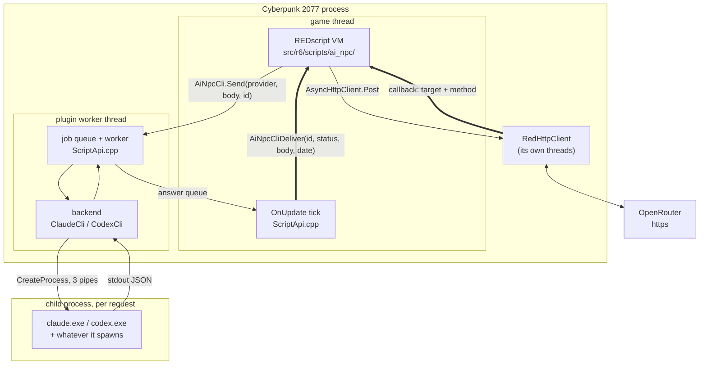
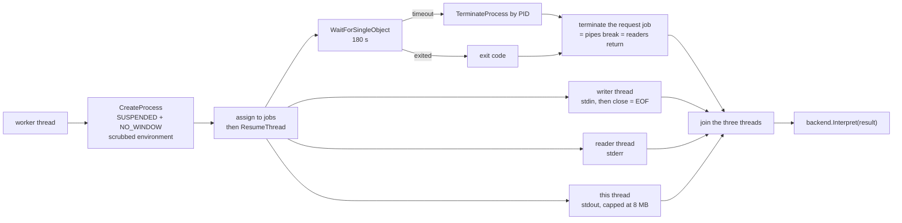
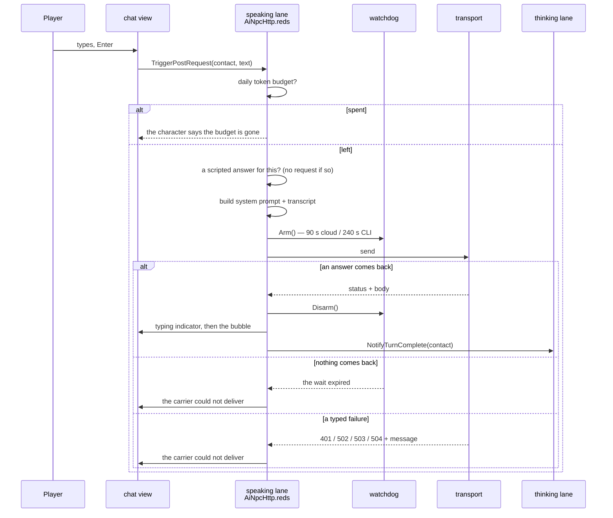
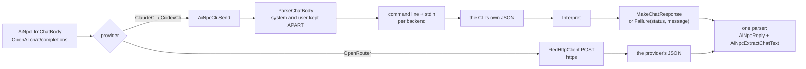
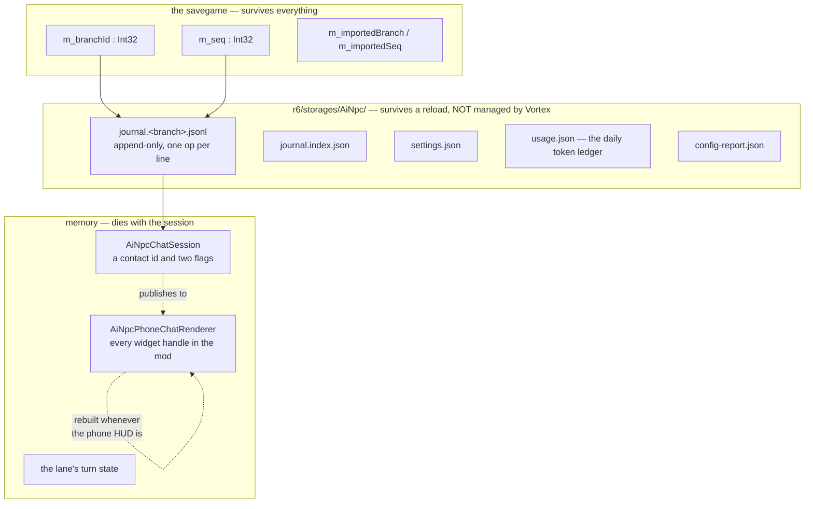
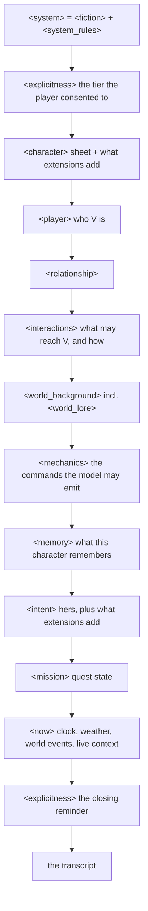
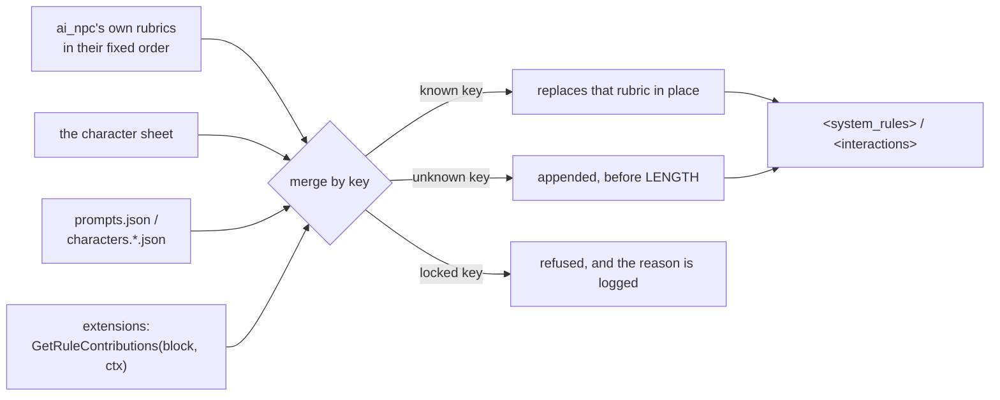
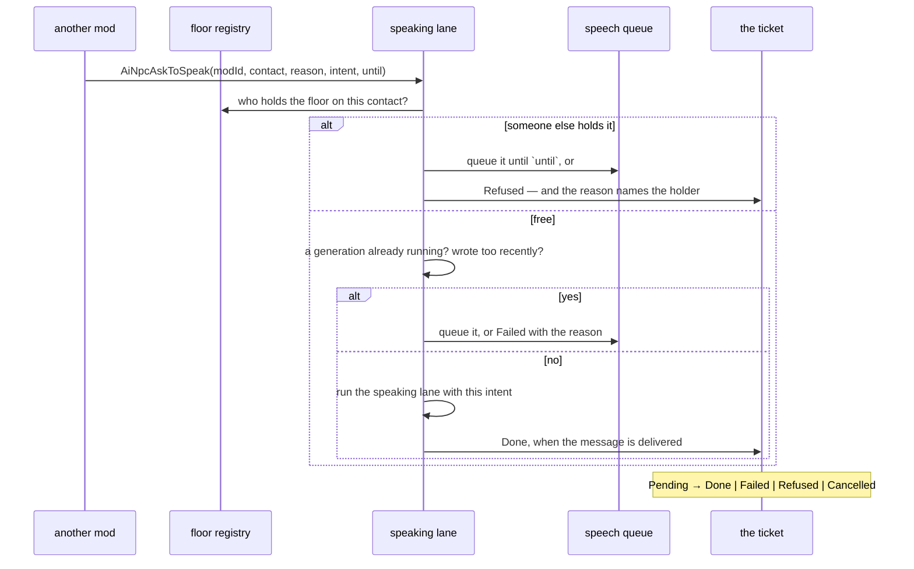
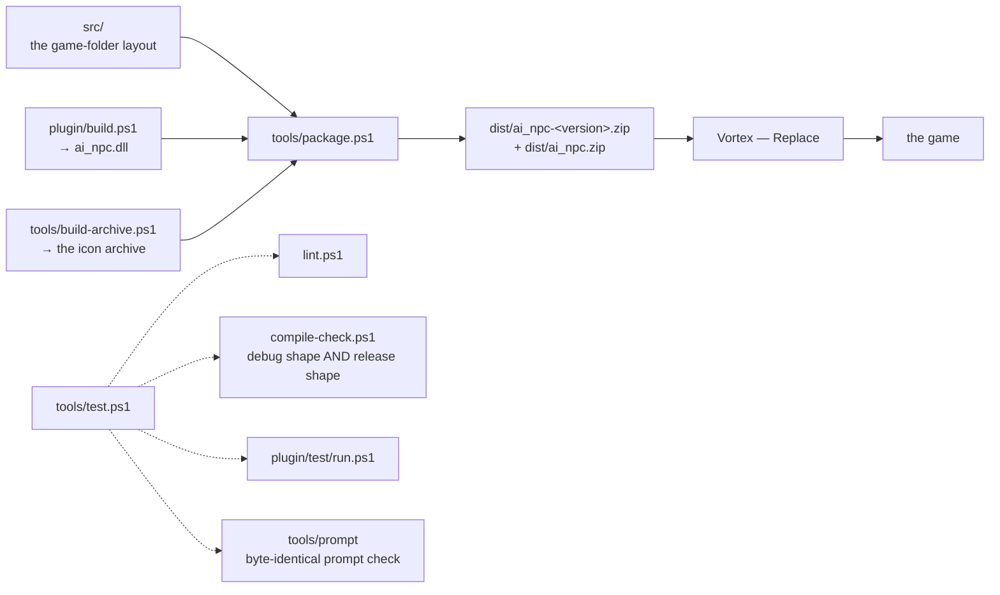

# How ai_npc works

The map of the running system: which piece lives in which process, on which thread, and what
survives what. It is the layer that is true *between* files, and therefore written in none of
them.

It is not a summary of the other documents. `README.md` already lists every file and what it
holds; `docs/API.md` is the integration contract; `docs/VIEW_ARCHITECTURE.md`, `docs/MEMORY.md`
and `docs/PROMPT_BUDGET.md` each own a subsystem. This file routes to them and does not
repeat them.

**Where do I go?**

| I want to | Read |
|---|---|
| give one of my contacts an AI voice, or extend a vanilla one | `docs/API.md` |
| know what a file does | the file map in `README.md` |
| understand the chat surfaces and their rules | `docs/VIEW_ARCHITECTURE.md` |
| understand what a character remembers | `docs/MEMORY.md` |
| change the prompt, and know what it will cost | `docs/PROMPT_BUDGET.md` |
| write or rewrite a character | `docs/CHARACTER_RULES.md`, `docs/CHARACTER_PROCESS.md` |
| build and ship | `README.md` § Packaging, `docs/DISTRIBUTION.md` |
| change the runtime | this file, then the file map |

---

## 1. The four constraints that shape everything

Nearly every design decision below is a consequence of one of these. Read them first and most
of the ceremony stops looking like ceremony.

1. **REDscript cannot start a process.** Reaching a command-line tool needs native code. That
   is the whole reason `ai_npc.dll` exists.
2. **Nothing may block the game thread.** A generation takes seconds; seconds on the game
   thread is a frozen game. Every request is therefore asynchronous, and every asynchronous
   request needs an answer to "what if it never comes back".
3. **REDscript has no `try`/`catch`.** There is no containment. Code that can fail must be
   written so that it cannot, or must check before it acts.
4. **The mod does not own the widget tree it paints on.** The engine builds and replaces the
   phone UI whenever it likes. A handle held across that is a handle into nothing.

A fifth, softer one runs through the whole thing: **a player pays for every token**, on a
metered key or against a subscription's fair-use. Cost is a design constraint here, not an
afterthought — hence `docs/TOKEN_BUDGET.md` and `docs/PROMPT_BUDGET.md`.

---

## 2. Where the pieces live

Four address spaces. The two crossings that matter are drawn thick: they are the places where
a mistake is silent rather than loud.



**The two thick edges are the contract.** `AiNpcCliDeliver` is a plain REDscript global
function whose signature is agreed by hand with `ScriptApi.cpp`. If the two ever disagree, no
error is raised anywhere — the answer simply never arrives, and the lane's watchdog reports it
as a provider that never replied. `AiNpcCliRequest.reds` and `ScriptApi.cpp` both say so at
the top, because it is the kind of breakage that has to be prevented rather than debugged.

Three facts on this picture are load-bearing and cost nothing to state:

- **The answer is delivered on the game thread, never on the worker.** Calling into the
  script VM from another thread corrupts it. RED4ext's `Running` game state gives a per-frame
  tick on the right thread, and that tick drains the answer queue.
- **`OnUpdate` must return `false`.** The SDK documents its result as ignored. It is not:
  returning `true` means "this state is done, do not call me again", the tick fires once, and
  every request completes with status 200 while no answer ever reaches script.
- **The child process is put in a job object before it is resumed**, so what it spawns dies
  with it — and in a *second*, per-request job as well, because the npm `.cmd` shim can exit
  while the node process it started still holds our pipe open.

### Inside one CLI request

`RunCapture` (`plugin/Process.cpp`) is where the operating system is actually touched. Three
flows have to move at once or the child deadlocks: it can block writing a large reply into a
full stdout pipe while we block writing its stdin.



**The wait comes before the joins, and that ordering is the timeout.** Reading on this thread
instead would make the budget unenforceable: a child that hangs without writing leaves
`ReadFile` blocked with no reader left to watch the clock.

**The environment is scrubbed.** `ANTHROPIC_API_KEY`, `OPENAI_API_KEY` and a dozen relatives
are removed before the child starts. An inherited key does not fail — it works, produces
identical replies, and bills per token for what the player's subscription already covers,
which is the opposite of what these lanes promise. The exact list is in `Transport.cpp`, and
it is worth re-reading against each CLI's documentation whenever one gains a new variable.

---

## 3. The lanes

A **lane** is one place that sends a request. There are four, and they are separate because
each has its own counter, its own clock, and its own re-entry point. The lane is encoded in
the request id itself:

```
requestId = laneCode * 1_000_000 + serial
```

so nothing has to be remembered between the send and the answer, and there is no registry to
fall out of step with.

| lane | code | what it does | where the answer re-enters |
|---|---:|---|---|
| speaking | 1 | the reply the player is waiting for | the chat bubble |
| repair | 2 | a second request inside one turn, when a command came back malformed | the same bubble, corrected |
| thinking | 3 | compacts old messages into memory, invisibly | the memory block, no UI |
| test | 4 | the setup window's connection test | the setup window |

The serial is what makes a **late** answer harmless: a request that timed out is not
cancelled — the process is still running and the plugin will still deliver — but by then the
lane has moved on and the stale answer is dropped instead of being written into a
conversation that has had three messages since.

### One turn, including the ways it fails



Three things this drawing is meant to make obvious:

- **The failure edges are the design.** A refusal, an expiry and a typed error all end the
  turn in the same shape, and the player is told by a character rather than by a HUD banner.
- **The watchdog exists because a request can simply never end.** `RedHttpClient` reports an
  answer and nothing else; a connection that dies mid-flight produces no callback at all.
  Since a `DelaySystem` callback cannot be cancelled, a wait is never cancelled either — it is
  **renamed**. Every wait gets a number, every timer carries the number it was armed for, and
  a timer whose number is no longer current has nothing to report.
- **The thinking lane is triggered by the end of a turn** (or by a conversation being
  opened), never by a timer. It keeps its own in-flight slot and shares no state with the
  speaking lane — deliberately, because routing it through that lane would raise
  `isGenerating` during a background task and grey out the player's input while nothing is
  being said to them.

---

## 4. Two transports, one dialect

The mod builds **one** request body and parses **one** response shape, whatever the provider.
The plugin speaks OpenAI `chat/completions` in both directions — not because it talks to
OpenAI, but so that the script side keeps a single builder and a single parser.



The consequence is worth stating plainly: **a CLI that is not signed in reaches the player
through the same lines of REDscript as an OpenRouter 401** — down to the sentence in the
bubble. A typed failure travels as a non-200 with `{"error":{"message":...}}`, which is the
shape the script side already reads.

**System and user stay apart all the way down.** Claude takes `--system-prompt-file`; Codex
has no system prompt and must fold the block into its input. Where that block goes decides the
instruction hierarchy the safe-for-work tier depends on, so it is a per-backend decision and
must not be pre-concatenated in script.

| | OpenRouter | Claude CLI | Codex CLI |
|---|---|---|---|
| needs | an API key | the CLI installed and signed in | the CLI installed and signed in |
| ships in the zip | nothing extra | `ai_npc.dll` | `ai_npc.dll` |
| billing | metered, per token | the player's subscription | the player's subscription |
| script timeout | 90 s | 240 s (backstop) | 240 s (backstop) |
| real deadline | the provider's | 180 s, in the plugin | 180 s, in the plugin |
| auth check | credential shape, in script | `auth status`, once per session | once per session |

The 240 s on a CLI lane is a **backstop, not a deadline**: the plugin runs the shorter clock
and answers with a typed "timed out" the player can act on. The script clock only fires when
the plugin itself never answers.

**The plugin knows about CLI backends only.** It must never learn what OpenRouter is — a
"provider" abstraction spanning both layers would be owned by neither.

### The CLI lanes are subscription-only

**An API key never drives Claude or Codex.** Those lanes exist because the player already pays a
subscription; a key satisfies the same CLI, returns identical replies and bills per token, which
is the opposite of what the menu entry promises. Keys belong to OpenRouter, where a cheap model
was chosen on purpose. An unauthenticated lane is refused with the fix named — sign in, or switch
to OpenRouter — never warned about and used anyway.

**The obvious check does not discriminate.** Measured 2026-08-24 on Claude Code 2.1.241 with
`ANTHROPIC_API_KEY` set: `claude auth status --json` still answers `"loggedIn": true` and
`"authMethod": "claude.ai"`. What proves a subscription is `apiKeySource` **absent** and
`subscriptionType` **non-null**. Codex is blunter: `codex login status` has no `--json` and no
tier, and only its `Logged in using ChatGPT` sentence passes — so a ChatGPT account with no Codex
quota passes the check and fails at the request, where the CLI's own sentence reaches the player.
The check answers whose money this is, not how much is left.

**The check runs in the environment the request will use.** Same scrub, same spawn path;
`auth status` run under a different environment describes a state nobody is in. `CODEX_HOME` is
deliberately not scrubbed — removing it signs the player out of the subscription the lane exists
to use.

**There is no OpenAI lane**, and its absence is a product decision rather than an oversight: it
duplicated OpenRouter for one more key, and its label promised a subscription reuse its code did
not do. `openAiApiKey`, `openAiModel` and the local-bridge keys are reported as ignored at
startup rather than silently dropped.

### What the plugin costs on a patch day

`AiNpcCliNative.reds` declares a native class, so if `ai_npc.dll` is absent or refused, script
validation fails and **the game does not start** — not the mod, the game. The risk is accepted
for this version, deliberately: shipping the declarations as a separate optional module only
narrows the window and does nothing for a DLL that is present and rejected, which is the actual
patch-day case. Two consequences follow from accepting it. The plugin keeps declaring
`RUNTIME_VERSION_INDEPENDENT` even though the SDK reserves that for loader-only plugins, because
a plugin refused on a declared version is a guaranteed block while an independent one resolves
through RED4ext's own table; and the native surface stays at one class and one function, since
every declared type is one more line in that fatal error.

**The exit is recorded rather than built.** Passing the request and the reply through files in
`r6\storages\AiNpc\`, which the mod already owns, declares no native type at all: the plugin
returns to loader-only and a missing DLL costs its lane and nothing else. The price is a polling
protocol — atomic writes, request ids, stale-file cleanup — and a latency that is noise beside a
multi-second CLI call.

### What the Codex lane has not had

It was written entirely from OpenAI's published documentation; nothing on this machine has the
CLI. So every flag in `CodexCli.cpp` carries the page it came from and its fixtures assert what
the documentation says, not what a run produced. Three things stay open and none can be closed
from here: **it has never been run in game**; **its safe-for-work tier is unmeasured**, since
Codex has no system prompt and the tier text is folded into the input, so the Claude number does
not transfer; and **the installer does not offer it** — no Codex page in `fomod/ModuleConfig.xml`,
no `CodexCli` preset staged — because advertising the lane comes after those two, not before.

The shell is removed with `--disable shell_tool`, a documented feature flag, and the sandbox is
the second line of defence behind it, in the position the Claude lane's denylist occupies.
Confinement was never equivalent to removal here: read-only sandboxing still permits reading
files anywhere on the filesystem, and this mod writes what comes back into its journal.

---

## 5. Where state lives, and what it survives

The single most useful picture in this file, because it is legible in no source file: the same
conversation exists in three places with three different lifetimes.



**The savegame holds a pointer, not the conversation.** Two integers: which branch file, and
how far into it this save had read. The conversation itself is an append-only journal of
operations on disk. That is what makes reloading an earlier save coherent: the pointer replays
to the right position, and the next message **forks** a new branch rather than overwriting
what the abandoned future wrote. Nothing on disk is ever rewritten. The full rules are in
`README.md` § the journal.

**The renderer is rebuilt; the session is not.** That asymmetry is the whole of the view
design. A renderer holds `wref`s into a tree the game owns and replaces; a session holds a
contact id and two flags and holds no widget at all. So the chat survives a HUD rebuild
instead of quietly painting into a tree nobody is looking at. See
`docs/VIEW_ARCHITECTURE.md`.

**`r6/storages/` is not managed by Vortex.** Unlike `r6/scripts/`, whose files are hard links
into the Vortex staging folder, this directory is the mod's own. It is safe to read and write
directly, and it is where every report and log the mod produces lands.

> **One mod, one storage.** `FileSystem.GetStorage("AiNpc")` is a claim of ownership, not an
> accessor. A second mod calling the same name has the storage **permanently revoked for both,
> for the rest of the session** — and the only trace is `red4ext/logs/redfilesystem-*.log`.
> The mod opens it once, in a `ScriptableService`, and hands the handle around. A companion
> mod must borrow that handle, never claim the name.

**Publishing freezes these formats.** The journal layout, the savegame pointer, the settings keys
and the `facts.*.json` schema become something other people's saves and other people's mods
depend on. What makes that survivable is already built: the data lives in files, the irreversible
part of a savegame is sixteen bytes of pointer, and `ai_npc_lab/journal/journal.py` plus
`importConversationsFrom` move and repair histories offline. After a release, a format change
needs a migration **and** a backup preserved at the migration point, which
`AiNpcConversationStore` already does twice (`LEGACY_BACKUP`, `MIGRATED_BACKUP`).

---

## 6. The prompt

One `AiNpcBuildSystemPrompt` call assembles every block, in this order. A block with nothing
to say emits nothing at all — no empty tag.



### Two of those blocks are composed, not written

`<system_rules>` and `<interactions>` are **lists of keyed rubrics in a fixed order**, not
paragraphs. A provider, a `characters.*.json` file or an extension contributes *by key*: a
known key replaces that rubric in place, an unknown one is appended. Nothing can drop the
block, reorder it, or wrap it.



**Three rubrics are locked in `<system_rules>` — FORM, TIME and LENGTH — and one in
`<interactions>` — PROMISES.** They are not editorial. They describe the surface the reply
lands on: one message per turn, no `Name:` prefix, a length that fits a phone bubble, time
markers the mod writes and the model may only read, and a promise to show up that something
will actually honour. A contact that wins those breaks the chat for the player, not the
characterisation.

Everything else is contributable, which is the point: a contact that is not a person needs
YOU and SETTING in its own words, and may need rubrics the cast never imagined. No shipped
sheet uses this; it is there for a provider another mod registers.

### What text from outside is allowed to be

Every string that reaches the prompt from a provider, a JSON file, an extension or a fact
watch passes through `AiNpcSafeSectionText`. **The prompt is a tree of tags this mod writes,
and text from anywhere else is a leaf.** A leaf carrying a tag stops being one: measured, a
`</character>` inside a character addition closes that block and lets what follows open a
`<system_rules>` of its own, with its own LENGTH, in a position nobody intended. Every locked
rubric above is worth exactly as much as this check.

It is **not** a ban on `<` and `>`. `<3` is in a shipped speech style and `->` is in half the
sheets; refusing those would refuse the mod's own text and teach authors to work around the
guard. What is refused is a *tag* — a closing one, or a name between angle brackets.

### The bounds

Refused rather than clamped where a half-sentence would be worse than nothing.

| what | bound |
|---|---:|
| one replaceable section (a bio, a world background) | 4 000 chars |
| one rubric | 600 chars |
| all rubric contributions to one block | 2 000 chars |
| one `<now>` line | 400 chars |
| all of `<now>` | 1 200 chars |

Rubrics are bounded tighter than `<now>` lines on purpose: a rubric sits in the **cacheable
prefix** and is read on every message, where length costs on every request rather than on the
ones an event interrupts.

### `<now>`, and the rule that governs it

`<now>` carries the clock, a neutral weather line, whatever another mod put on the wire for
this contact, and the character's own live context.

**Nothing in `<now>` may ask for an output.** A line there lands after `<mechanics>` and last
but for the closing token, so an instruction placed in it competes with the one the prompt
already gave, from a later and more specific position — measured at 5 replies in 6 emitting
their action command with no ambient event live, against 1 in 6 with an instruction-bearing
one. Context only; output rules belong in `<system_rules>`, stated once for every message.

A sentence arriving from a quest-fact watch is framed as `[WORLD EVENT: …]` rather than
inlined. Under the clock, in a prompt where every other line is either the character's own
sheet or something V said, a bare sentence reads as V having said it. The frame is what makes
it the world reporting instead. The sentence itself is passed through untouched — another
mod's author wrote it about their own content, and rewording it here would be a translation
layer with nobody to check it.

### What it costs

The section shares below were measured on the **previous** prompt shape (`docs/PROMPT_BUDGET.md`,
2026-08-22) and have not been re-measured since the rubric redesign. Treat them as the order
of magnitude, not the current bill: the two heaviest blocks were the world lore and the rule
block at roughly a third each, the memory came third, and the commands — the feature anyone
would disable first — were under a tenth. Re-measure before optimising anything.

`docs/PROMPT_BUDGET.md` also records the rule that survived the redesign: a toggle must remove
*both* the prompt text and the code that reads the answer. Prompt without parser, and the
character promises what will never happen; parser without prompt, and it is dead code waiting
for a tag nobody was told to write.

### Placeholders

Fragments are written with `{npc}`, `{they}`, `{language}`, `{register}` and expanded once,
per contact. Substitution is single-pass: a value substituted in is never re-scanned. The
values themselves must come from sources that do not expand a template of their own — that
invariant is still held by comments alone, and it is item D of `docs/PLAN_ROBUSTNESS_1_0.md`.

---

## 7. How another mod joins in

`docs/API.md` is the contract. What belongs here is the one picture it does not draw: what
happens when a third-party mod wants a character to **write first**.



Three ideas carry the whole surface:

- **The floor** is a lease on a contact — one holder at a time, with an expiry (300 s by
  default), so a mod that crashes or forgets cannot silence a character for ever.
- **A ticket** is how the asking mod learns what became of its request. It always settles.
  `Refused` and `Failed` are deliberately different: refused means somebody else had the
  right of way, failed means it could not be done.
- **Declaring a contact and extending one are different jobs.** One mod may declare a
  contact; any number may extend one. A vanilla character is already declared — you extend
  her, because two mods cannot both be right about who she is.

### What an extension may put in the prompt

Each hook takes the contact's context, so the same extension can answer differently for
different characters and different moments. Everything it returns is bounded and checked for
markup by the rules in section 6 — an extension cannot enlarge its own budget, and its
refusals are logged with its name on them.

| hook | lands in | bound |
|---|---|---:|
| `GetRuleContributions(block, ctx)` | `<system_rules>` or `<interactions>`, by key | 600 / 2 000 chars |
| `GetIntentAddition(ctx)` | `<intent>`, on its own line under the character's | 400 chars |
| `GetActionAddition(ctx)` + `GetActionTags` / `GetActionTagPrefixes` | `<mechanics>`, plus the tags it claims | — |
| `GetLiveContextAddition(ctx)` | `<now>` | 400 / 1 200 chars |
| `GetScriptedReply(ctx)` | answers instead of the model; no request is sent | — |

A locked key is refused, not silently dropped: `AiNpcRuleRefusal` gives one sentence, and the
config report and the runtime log print the same one.

Built-in characters use the same road for their own arcs. A sheet declares arc beats
(`AiNpcCastArc.reds`), each becomes a quest-fact watch, and what the watch reports arrives in
`<now>` framed as a world event — the same shape a third-party mod gets.

---

## 8. Invariants the compiler cannot see

The highest-value page in this document. Every line below is a rule whose violation compiles
cleanly, and most of them were learned the expensive way.

| Invariant | What breaks if it is violated | What holds it today |
|---|---|---|
| `OnUpdate` returns `false` | every request completes and no answer ever reaches script | a comment, and nothing else |
| the native surface stays at one class, one function | each declared native type is one more line in a script-validation error that **stops the game from starting** when the DLL is absent | a comment in `AiNpcCliNative.reds` |
| a native class declares an `IScriptable` parent | registered without one it is a struct to the RTTI; the script blob is refused and the game does not start | `PostRegisterTypes` |
| `AiNpcCliDeliver`'s signature matches `ScriptApi.cpp` | answers silently never arrive; the watchdog blames the provider | nothing — a hand-kept contract, stated at both ends |
| one mod per RedFileSystem storage name | the storage is revoked **for both mods** for the session; the only trace is `redfilesystem-*.log` | one `GetStorage` call, in a service |
| no stale `.reds` in the deployed folder | a duplicate free function compiles with zero warnings, and the last file loaded wins — silently | `tools/lint.ps1` checks the repo, not the game folder |
| template value sources never expand a template | unbounded recursion inside prompt construction | comments |
| text from outside the mod carries no tag | a `</character>` closes the block it sits in, and what follows opens a `<system_rules>` of its own | `AiNpcSectionText.reds`, asserted |
| a rubric block is rendered under its own tag | two `<system_rules>` in one prompt, and no `<interactions>` at all | `tests\AiNpcTestPrompt.reds`, asserted on a block that is not `system_rules` |
| a toggle removes prompt text **and** the parser | the character promises what will never happen | `docs/PROMPT_BUDGET.md`, by convention |
| every reply handler checks it is still the current one | a late answer lands in the wrong conversation | `AiNpcWatchdog.IsWaiting()`, consulted by both transports in both lanes |
| everything shipped lives under `src/` at its real game path | the file is in the repo and absent from the zip, or present and never loaded | `tools/package.ps1` verifies the zip |
| `.reds` are UTF-8 without BOM | `Get-Content`/`Set-Content` corrupts accents invisibly; `scc.exe` still passes | `docs`, and care |

If you add a rule of this kind, add it here. A rule that lives only in the head of whoever
wrote it is a rule with a deadline.

> **What this table cannot catch.** The offline builder re-implements the mod rather than
> comparing against it, so a rule both halves break stays invisible: `tools/prompt` renders
> `<%s>` from the block name and `AiNpcRenderRules` hardcoded `<system_rules>` for months
> without the oracle noticing, because the oracle compares a rebuilt prompt to a captured one
> and both were rebuilt from the same wrong source. A control token is the same shape of hole:
> `corpus.json` is extracted from the `.reds`, so `<|eot_id>` — missing its closing bar, and
> therefore ordinary text to a Llama tokenizer — matched byte for byte on both sides. What
> would catch either is an assertion about the prompt's *shape* written by hand, once.

---

## 9. Building, and what the checks can and cannot prove

One path reaches the game. There is no other, and manual copying into the game folder is not
a shortcut — it desynchronises Vortex from what it believes it deployed.



What `package.ps1` refuses to ship: a build with no single `AiNpcVersion()`, a hardcoded API
key anywhere under `r6/scripts`, a FOMOD whose XML does not parse, a FOMOD pointing at a
folder the archive does not contain, or a zip missing the icon archive. It checks the
**staged** copy and then re-opens the finished zip, because a file can be at the right path in
the repo and absent from what ships.

What none of it can prove: **that the mod works.** Nothing in the offline suite launches the
game. Runtime assertions exist (`src\r6\scripts\ai_npc\tests\`, dropped from release builds) but their
results are read back from a file, which means a green report can be a replay of an older
run. Treat "offline green" and "verified in game" as two different claims — this repository's
own documents are careful to, and so should any change be.

**What only a launch can prove**, and what to walk when a change touches it:

- **the two chat surfaces.** No assertion can touch a widget. Open a chat from the phone, close
  it before the reply lands (the reply must arrive as an SMS notification, filed under the right
  contact), switch contacts while a reply is generating, and scroll the contact list quickly
  across supported and unsupported contacts. With BrowserExtension installed, the same on a
  terminal, plus the field's keyboard capture: it must end with the page or with the player's own
  gesture, never only with a sent message.
- **each lane, end to end.** The setup window's connection test makes this cheap for OpenRouter;
  the CLI lanes need the CLI installed and signed in, and Codex has never been run at all.
- **the eight languages.** `lint.ps1` checks the tables agree; nothing checks the output reads
  well.
- **the dependency stack.** Seven hard requirements is seven ways for a stranger's install to be
  wrong — a compile failure naming ai_npc is what a player will report. Mods that restructure the
  phone contact list hook where we hook, and Phone Extension Framework is why `AiNpcContactHash`
  exists.

**No log on this machine records script-VM errors.** `redscript_rCURRENT.log` is the compilation
log and closes seconds after launch, so every criterion above is an observable symptom rather
than a log line. `r6\storages\AiNpc\test-results.json` reports the runtime assertions, and it
is a replay until the game has been launched again.

---

## 10. Licence, dependencies, and the edges of what MIT covers

**The mod is MIT; the repository is not.** `LICENSE` states the scope: the grant covers what
ships to a player — `src/`, `plugin/` and `fomod/`, the last named explicitly because it sits
outside `src/` and travels in the archive anyway. `tools/`, `docs/` and `source/` are not
licensed, and `vendor/` is a submodule under somebody else's terms. So a fork may take the
mod; it does not thereby take the packager, the linters or this page.

Three further things that licence does not settle, and that a fork should know:

**The frameworks are not vendored.** `README.md` lists the seven hard requirements — RED4ext,
redscript, Codeware, RedHttpClient, RedData, RedFileSystem, Mod Settings — and the optional
ones. They are installed by the player, each under its own terms; this repository ships none
of them. `vendor/RED4ext.SDK` is a git submodule used to build the plugin and carries its own
licence.

**No credentials ship, by construction.** `settings.json` is created at first run in the
player's own storage. `package.ps1` scans every `.reds` for key patterns and refuses to build
if it finds one, and the plugin removes provider API keys from the child's environment before
spawning it.

**The CLI lanes rest on the player's own account.** The code that drives `claude` or `codex`
lives in `plugin/` and is covered by the grant, but what those tools do is governed by the
player's subscription and
that provider's terms — which is theirs to accept, not this project's to grant. A fork that
redistributes must not ship credentials, and should not present a subscription lane as
something the mod provides.

**Assets are not code.** Anything under `src/archive/` and `source/` is game-format content
and should be treated separately from the MIT grant when in doubt.

---

*Last checked against the tree on 2026-08-26. If something here contradicts the code, the
code is right and this file is a bug.*
